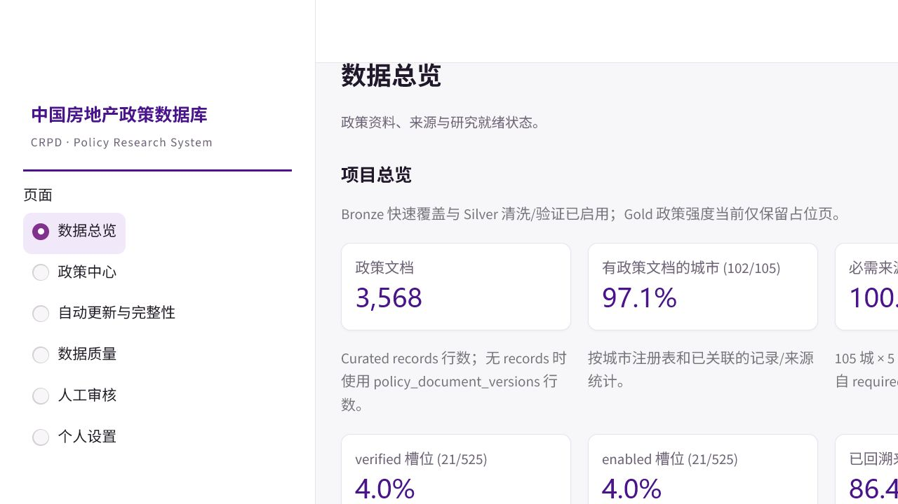
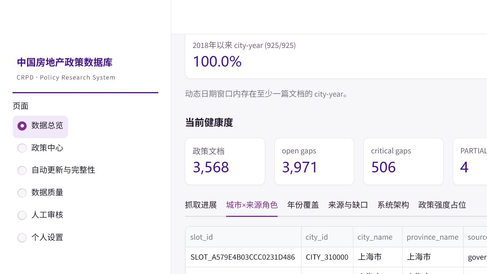
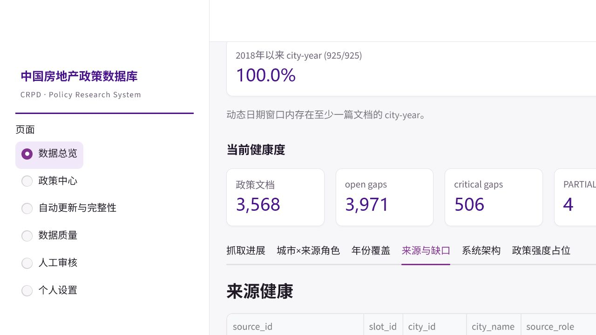

<div align="center">

# 中国房地产与城市政策研究数据库

## China Real Estate & Urban Policy Database · CRPD 3.0

**面向中国城市房地产政策研究的可追溯、可补全、可持续更新数据基础设施**

`Python 3.12+`　`DuckDB`　`Parquet`　`Streamlit`　`AI-assisted`　`Windows`

</div>

---

## 项目简介

CRPD 针对传统券商政策库偏重大城市、下沉城市覆盖不足，以及政策原文、附件、版本和采集过程难以追溯等问题，在既有中金政策数据基础上，搭建了一套覆盖以下环节的政策数据系统：

```text
政策来源发现
→ 官方来源验证
→ HTML / PDF 原文归档
→ 结构化解析
→ AI 辅助复核
→ 去重与版本治理
→ 完整性审计
→ 持续更新与研究导出
```

项目当前覆盖 **105个城市、5类必需官方来源角色和2018年以来政策文本**，并为城市—月份、城市—年份、多期双重差分及政策工具异质性研究预留标准化数据接口。

> **当前阶段说明**
>
> CRPD 3.0 已基本完成系统架构、抓取管线、Dashboard、PDF处理和运行控制建设，正由“工程开发”转入“规模化数据生产”。
> 当前较低的 verified、enabled 比例主要反映525个来源槽位尚未全面执行大规模搜索与验证，并不表示相应功能尚未实现。

---

## 当前数据快照

> 以下指标为当前运行快照，反映最低覆盖和生产进度，不代表所有城市、年份和来源已经穷尽。

| 指标                 |          当前结果 | 说明                  |
| ------------------ | ------------: | ------------------- |
| 政策文档               |     **3,568** | 当前进入正式或兼容数据视图的政策记录  |
| 有政策文档城市            | **102 / 105** | 城市最低文本覆盖率为97.1%     |
| 必需来源槽位             | **525 / 525** | 105城 × 5类来源角色已全部登记  |
| 已解析来源槽位            | **254 / 525** | 已发现候选或进入非未解析状态      |
| 严格验证槽位             |  **21 / 525** | 已通过官方性、机构角色和可抓取性验证  |
| 正式启用槽位             |  **21 / 525** | 已纳入自动更新与历史回溯流程      |
| 进入回溯状态来源           |   **19 / 22** | 当前实际试运行来源中的回溯进度     |
| PARTIAL_BUT_USABLE |    **4 / 22** | 已有可用文本，但尚未证明历史或附件完整 |
| 2018年以来 city-year  | **925 / 925** | 每个城市—年份至少有一篇文档      |
| Open gaps          |     **3,971** | 待补来源、年份、字段、附件和运行缺口  |
| Critical gaps      |       **506** | 需要优先补全或复核的关键缺口      |

### 如何理解这些比例

* **525/525 必需来源槽位**：表示来源任务框架已经完整建立，不代表525个官方网址均已找到。
* **21/525 verified**：表示21个槽位完成严格验证；当前尚未全面运行525槽位的搜索和验证任务。
* **21/525 enabled**：表示已验证的21个来源均已纳入正式抓取。
* **19/22 回溯状态**：分母是当前参与试运行的22个来源，而非全部525个槽位。
* **925/925 city-year**：表示每个城市—年份至少有一篇政策，不等于该年份政策已经穷尽。
* **PARTIAL_BUT_USABLE**：表示数据可用，但分页、历史年份或附件仍需继续补全。

---

## 系统架构


### 分层数据体系

| 数据层        | 当前状态 | 主要职责                      |
| ---------- | ---- | ------------------------- |
| **Bronze** | 已启用  | 快速覆盖、原始HTML/PDF/附件和抓取证据归档 |
| **Silver** | 已启用  | 解析、清洗、验证、去重、版本管理和缺口补全     |
| **Gold**   | 禁用占位 | 政策强度、政策工具和研究指标测度          |

Gold 当前不会调用政策强度模型，也不会生成虚构的强度值。未测度字段保持为空或显式标记为未启用。

---

## 核心能力

### 1. 105城官方来源矩阵

每个城市设置五类必需来源角色：

| 来源角色     | 主要内容               |
| -------- | ------------------ |
| 市政府      | 政府政策文件、规范性文件和政策发布  |
| 政府公报     | 正式公报、政策汇编和历史文件     |
| 住房城乡建设部门 | 房地产、住房、城市更新和建筑管理政策 |
| 住房公积金中心  | 公积金贷款、提取和缴存政策      |
| 自然资源部门   | 土地供应、规划和用途管制政策     |

来源发现采用：

```text
搜索 API / AI 候选发现
→ 官方域名校验
→ 城市归属校验
→ 机构与来源角色识别
→ HTTP及页面类型检测
→ 正文解析能力验证
→ 正式启用
```

没有证据的来源保持 `unresolved`，系统不会使用推测网址填补槽位。

### 2. 广度优先全量抓取

`FAST_BULK_INGEST` 采用城市轮转和来源预算机制：

* 单来源时间预算；
* 列表页数量预算；
* 文档数量预算；
* PDF和附件预算；
* checkpoint / resume；
* 失败来源让出执行权；
* 不允许单个复杂网站阻塞105城任务。

全量生产划分为六轮：

```text
ROUND 1  城市快速覆盖
ROUND 2  来源角色补齐
ROUND 3  缺失年份补齐
ROUND 4  深度分页与历史回溯
ROUND 5  PDF与附件补全
ROUND 6  人工审核与长期失败处理
```

### 3. AI辅助解析与自动复核

AI用于：

* 政策标题、日期、文号和发布机关提取；
* 政策对象和政策工具识别；
* 综合文件的政策动作拆分；
* 分类建议和证据定位；
* 第二轮独立复核；
* 置信度路由。

AI不得生成原文中不存在的标题、日期、机关、文号、URL或政策内容。

### 4. 政策对象与版本治理

系统区分四类核心对象：

| 对象                 | 含义              |
| ------------------ | --------------- |
| `policy_entity`    | 政策本体            |
| `document_version` | 正式发布或修订版本       |
| `publication_copy` | 不同网站和部门的发布、转载副本 |
| `policy_action`    | 文件内部的具体政策动作     |

同一政策的多个转载页面只形成一个政策实体，但所有来源URL、发布主体和原始证据均被保留。

### 5. 多证据联合去重

系统综合使用：

* 规范化URL；
* PDF二进制SHA-256；
* HTML和正文哈希；
* 文号；
* 标题；
* 发布机关；
* 发布日期；
* 语义相似度。

不同版本不会被直接覆盖，而是形成可追溯的版本关系。

### 6. HTML与PDF双轨原文

PDF已经被纳入正式数据管线：

```text
已有PDF盘点
→ SHA-256内容寻址归档
→ 网页PDF发现
→ 下载与文件校验
→ PyMuPDF逐页解析
→ 政策关联
→ Dashboard查看
```

系统遵循：

* HTML与PDF分别保存；
* PDF附件不覆盖网页正文；
* 没有PDF时继续使用HTML原文；
* 扫描型PDF标记为 `OCR_PENDING`；
* OCR当前默认关闭；
* 原始PDF不进入Git仓库。

---

## 五类政策体系

政策以 `policy_action` 为最小分类单位，综合文件可以拆分为多个政策动作。

| 代码  | 一级政策类型    |
| --- | --------- |
| `D` | 需求侧政策     |
| `S` | 供给侧政策     |
| `F` | 房地产金融与风险  |
| `H` | 住房保障与城市更新 |
| `G` | 市场监管与制度治理 |

中金原始Excel的工作表、topic和行号继续作为数据血缘字段保留，但不再作为唯一分类标准。

---

## Dashboard

Dashboard 默认只监听本机地址：

```text
http://127.0.0.1:8501/
```

主要页面包括：

* 数据总览；
* 政策中心与政策详情；
* 城市—来源角色覆盖矩阵；
* city-year覆盖；
* 自动更新与完整性；
* PDF发现、下载和解析；
* 数据质量与缺口审计；
* 人工审核；
* 系统架构；
* Gold政策强度占位。

Dashboard读取真实DuckDB、Parquet、来源注册表、checkpoint、gap和automation状态，不使用模拟数据。

所有操作通过经过校验的JSON任务队列进入正式业务层，不接受任意Shell命令。

### Dashboard截图

#### 数据总览



#### 城市覆盖矩阵



#### 来源与缺口审计



---

## 快速开始

### 环境要求

* Windows 10 / 11；
* PowerShell；
* Python 3.12+；
* Git；
* 推荐使用项目自带虚拟环境或 `uv`。

### 普通用户

```text
首次安装.bat
打开房地产政策数据库.bat
关闭房地产政策数据库.bat
```

### 开发者

```powershell
uv sync --all-extras
uv run policydb validate
uv run policydb dashboard
```

或使用项目虚拟环境：

```powershell
.\.venv\Scripts\policydb.exe validate
.\scripts\start_dashboard.ps1 -NoBrowser
.\scripts\check_dashboard.ps1
```

停止Dashboard：

```powershell
.\scripts\stop_dashboard.ps1
```

---

## 开始小批量抓取

建议先执行有界测试，不要首次运行即启动105城无限任务。

```powershell
$env:CRPD_DATA_ROOT = "D:\Data Set\CRPD"

.\.venv\Scripts\python.exe `
  -m policydb.autopilot_cli fast-bulk-ingest `
  --config .\config\continuous_sync.yaml `
  --dry-run
```

运行5个城市：

```powershell
.\.venv\Scripts\python.exe `
  -m policydb.autopilot_cli fast-bulk-ingest `
  --max-cities 5 `
  --apply `
  --resume
```

建议按以下顺序扩大范围：

```text
本地fixture
→ 单一真实来源
→ 单一城市
→ 5个城市
→ 10个低覆盖城市
→ 105城第一轮快速覆盖
```

---

## PDF处理

### 盘点D盘已有PDF

```powershell
.\.venv\Scripts\python.exe `
  -m policydb.autopilot_cli pdf inventory `
  --root "D:\Data Set\CRPD"
```

### 小批量归档、发现和解析

```powershell
.\.venv\Scripts\python.exe `
  -m policydb.autopilot_cli pdf archive `
  --root "D:\Data Set\CRPD" `
  --limit 20 `
  --apply

.\.venv\Scripts\python.exe `
  -m policydb.autopilot_cli pdf discover `
  --limit 20 `
  --apply

.\.venv\Scripts\python.exe `
  -m policydb.autopilot_cli pdf download `
  --limit 10 `
  --workers 4 `
  --apply

.\.venv\Scripts\python.exe `
  -m policydb.autopilot_cli pdf parse `
  --limit 10 `
  --workers 2 `
  --apply
```

详细说明参见 [PDF处理管线](docs/PDF_PIPELINE.md)。

---

## D盘数据存储

推荐数据根目录：

```text
D:\Data Set\CRPD
├─ archive
├─ raw
│  └─ pdf
├─ derived
├─ curated
├─ research
├─ database
├─ manifests
├─ logs
├─ outputs
├─ jobs
├─ control
├─ quarantine
└─ backups
```

推荐环境变量：

```text
CRPD_DATA_ROOT=D:\Data Set\CRPD
CRPD_ARCHIVE_ROOT=D:\Data Set\CRPD\archive
POLICYDB_DATABASE=D:\Data Set\CRPD\database\policydb.duckdb
POLICYDB_CURATED_ROOT=D:\Data Set\CRPD\curated
POLICYDB_RESEARCH_ROOT=D:\Data Set\CRPD\research
POLICYDB_LOG_ROOT=D:\Data Set\CRPD\logs
POLICYDB_OUTPUT_ROOT=D:\Data Set\CRPD\outputs
```

正式存储迁移采用：

```text
复制
→ SHA-256校验
→ 写入非敏感配置
→ 完整性验证
```

系统不会删除源文件；D盘不可用时也不会静默回写C盘。

---

## 搜索与AI配置

支持的搜索服务包括：

* Serper；
* Tavily；
* Bing。

搜索结果只作为候选，普通媒体和非官方转载不会直接成为canonical source。

AI和搜索密钥应保存在Windows Keyring或本机环境变量中，不得写入：

```text
Git
README
DuckDB
Parquet
JSON任务
日志
命令行参数
```

测试AI连接：

```powershell
uv run policydb ai test
uv run policydb ai models
```

---

## 数据完整性

CRPD分别报告：

| 完整性维度 | 定义                                |
| ----- | --------------------------------- |
| 城市覆盖  | 有政策文本城市数 / 注册城市数                  |
| 来源覆盖  | resolved、verified、enabled槽位 / 525 |
| 时间覆盖  | 有文本的city-year / 配置期内city-year     |
| 字段完整  | 标题、日期、正文、URL、哈希和来源字段              |
| 历史回溯  | 已形成回溯状态的来源                        |
| PDF完整 | PDF发现、下载、解析、关联和OCR状态              |
| 数据新鲜度 | 最近一次成功抓取或来源更新时间                   |

### 状态语义

| 状态                   | 含义             |
| -------------------- | -------------- |
| `SUCCESS`            | 当前有界任务成功完成     |
| `COMPLETE_WITH_GAPS` | 主范围完成，但存在少量缺口  |
| `PARTIAL_BUT_USABLE` | 已有可用文本，但尚未证明完整 |
| `PARTIAL_EMPTY`      | 当前批次未取得有效文档    |
| `RETRY_WAIT`         | 等待后续网络或来源重试    |
| `HUMAN_REVIEW`       | 需要人工确认         |
| `FAILED_TERMINAL`    | 当前自动流程无法继续     |
| `OCR_PENDING`        | PDF疑似扫描件，等待OCR |

“任务运行完成”不等于“政策覆盖完整”。未扫描、失败和未知状态不会被转换为零政策。

---

## 研究数据与导出

系统面向以下研究单元输出数据：

* 政策动作；
* 城市—月份；
* 城市—年份；
* 城市—政策类型—年份；
* 来源角色覆盖；
* city-year完整性；
* 文档和PDF归档覆盖；
* 缺口约束研究面板。

常用命令：

```powershell
uv run policydb search `
  --keyword "城市更新" `
  --region "武汉市"

uv run policydb stats `
  --group-by year,province,topic

uv run policydb export `
  --view city_month_panel `
  --format xlsx `
  --output outputs/city_month_panel.xlsx
```

研究快照为不可变目录，后台持续抓取不会直接修改既有快照。

当前Gold政策强度状态：

```text
policy_intensity_enabled = false
policy_intensity_rows = 0
```

---

## 质量控制

```powershell
uv run ruff check .
uv run pytest --basetemp .test-tmp-local
uv run policydb validate
uv run policydb migrate-v2 verify
uv run policydb sources validate-registry
```

系统质量边界包括：

* Raw原文永不覆盖；
* 多网站转载保留全部发布证据；
* 去重不删除版本关系；
* AI结果必须能够定位到原文证据；
* 未知和未扫描状态保持为空；
* 抓取、解析和Dashboard相互解耦；
* 原始PDF、数据库和API密钥不进入Git。

---

## 文档导航

| 文档                                         | 内容                       |
| ------------------------------------------ | ------------------------ |
| [系统架构](docs/ARCHITECTURE.md)               | Bronze、Silver、Gold及运行数据流 |
| [Dashboard指南](docs/DASHBOARD_GUIDE.md)     | 页面、指标、操作队列和安全边界          |
| [运行手册](docs/OPERATIONS.md)                 | 启动、暂停、恢复和故障处理            |
| [数据完整性](docs/DATA_COMPLETENESS.md)         | 指标、分母和状态解释               |
| [全量抓取流程](docs/FULL_CRAWL_WORKFLOW.md)      | 六轮全量生产流程                 |
| [逐市补齐流程](docs/CITY_COMPLETION_WORKFLOW.md) | 城市和来源角色补全                |
| [PDF处理管线](docs/PDF_PIPELINE.md)            | 归档、下载、解析和预览              |
| [状态模型](docs/STATUS_MODEL.md)               | 任务、来源和文档状态语义             |

---

## 当前阶段与路线图

### 已完成

* [x] Bronze原始采集层；
* [x] Silver清洗与验证层；
* [x] 105城×5来源角色注册矩阵；
* [x] FAST_BULK_INGEST；
* [x] checkpoint / resume；
* [x] Streamlit Dashboard；
* [x] HTML原文归档；
* [x] PDF盘点、归档、下载、解析和预览；
* [x] 数据质量与缺口审计；
* [x] 研究快照；
* [x] GitHub Actions测试。

### 正在推进

* [ ] 525个槽位大规模来源发现和严格验证；
* [ ] 3个无文本城市补齐；
* [ ] 2018年以来逐市历史回溯；
* [ ] 深层分页与复杂政府网站适配；
* [ ] PDF附件和政府公报补全；
* [ ] critical gaps持续压降。

### 后续计划

* [ ] 中文扫描PDF OCR；
* [ ] 政府公报自动拆分；
* [ ] 政策工具和政策强度指标体系；
* [ ] 多期DID研究面板；
* [ ] 数据版本发布和引用规范。

---

## 项目边界

CRPD是一套政策数据基础设施，而不是对政府网站永久可用性的承诺。

政府网站可能发生：

* 页面改版；
* 域名迁移；
* TLS异常；
* 验证码或访问限制；
* robots规则变化；
* 历史页面下线；
* 附件失效。

系统通过来源健康检查、失败重试、替代入口、缺口登记和人工审核降低上述风险，但不会将未完成扫描错误标记为完整。

---

<div align="center">

**CRPD 3.0**

从静态政策表，走向可追溯、可补全、可持续更新的城市政策研究基础设施。

</div>
